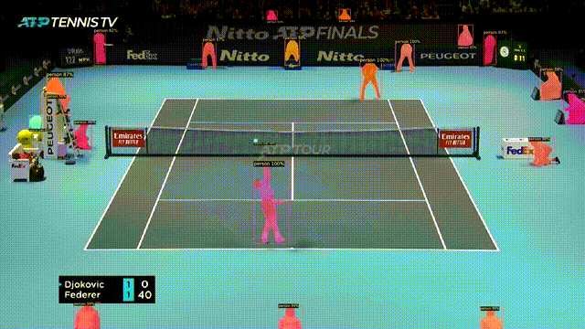

How can we track the player pixel locations in a video? How can we track the tennis ball pixel locations?  And where can we deploy our deep learning models?

# Introduction
The goal of this blog post is to describe how I tracked the player and tennis ball pixel locations using deep learning models and how I set this up to run for multiple tennis videos. 

# Player & Ball Tracking
Object detection is a well studied deep learning problem. To not re-invent the wheel, I used the state of the art (at time of this writing) pre-trained object detection model Detectron2 developed by Facebook. In a similar way, I found a deep learning model which performed well on ball tracking data and adjusted it to me needs. My laptop did not have GPUs available, so I decided to move the predictions into Google Colab to make use of the speed benefits. The process to extract player and ball tracking data looked as follows:

1. I uploaded tennis mp4 videos into Google Drive
2. I cloned my GitHub repo into Google Colab
3. The GitHub code pulled all required videos from Google Drive, pulled them into Google Colab, split them into single videos and set them up for model predictions
4. Detectron2 and ball prediction model were detecting objects/ball pixel locations frame-by-fame
5. The results were processed 
    a For Detectron2, this meant filtering out non-human objects
6. The cleaned pixel predictions for both models were stored in json files which included additional image metadata and put into Google Drive

Below you can see a visualisation of the Detectron2 model predictions:

When filtering the player predictions for the competing players and visualising their geometric center and visualising the ball predictions, it looks like this: 

# Conclusion
At the end of this process, all json tracking files were stored into Google Drive.