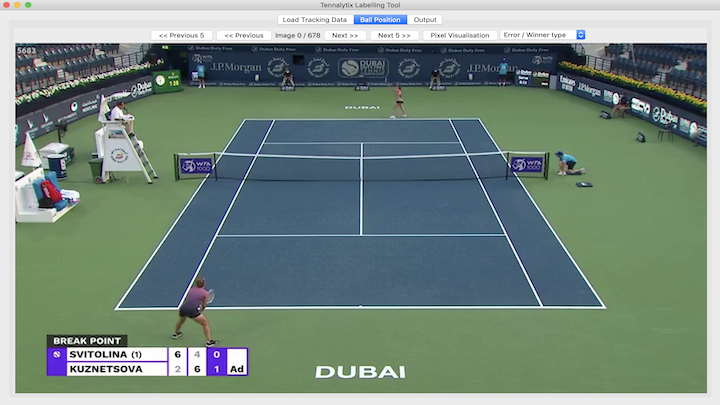
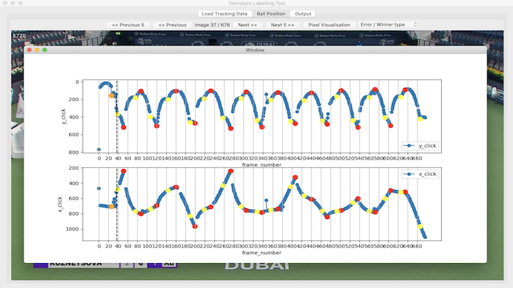
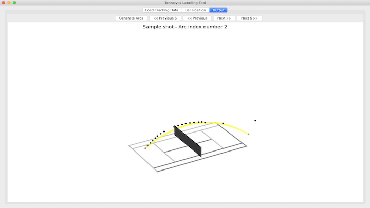

# Introduction
In this third blog post, I will describe how I built a user interface with the Python interface library Tkinter. The goal of this interface was to visually inspect player and ball predictions and overwrite predictions where the model went wrong. Additionally, one can generate the 3d data in this tool, in which the process is described in the next blog post. 

First, I will describe the functionalities of the interface. Second, I will highlight the implementation. 

# Functionalities
## Ball Locations / Overwrite Functionality



## Output Window


## Data Handler
When interacting with the interface, a data handler class is responsible for updating json files. Amongst other metadata, the json object contains frame information in the format below: 

```
"frame_info": [
    {
        "frame_number": 10,
        "type": "shot",
        "x_click": 629,
        "y_click": 88
    },
    {
        "frame_number": 11,
        "type": "moving",
        "x_click": 637,
        "y_click": 99
    }
]
```

## Menu Bar
The menu bar offers the option to import a new file, save a new file or exit the window. 

# Technical Implementation
Tkinter is a very popular Python framework to create a user interface. I did not user Tkinter before but there were loads of helpful tutorials and examples out there which made the start very easy.

I followed best coding practices (I wrote another [blog post](/blog/02_best_software_engineering_practices) on this here) which amongst other things meant to moduralise the code and create a separate class for each component. I created a controller class in which all other classes were instantiated. This made it possible for all other classes to interact with each other. This made the development process a lot easier. 

Overall, I ended up with several components:
- `Controller` class
    - Contains all Tkinter functionialities; made interaction between classes easy
- `DataHandler` class
    - Load predictions and save overwritten predictions to files
- `BallPixelPositions` class
    - Canvas with ball predictions visualisation and ability to overwrite model predictions
- `OutputWindow` class
    - Canvas on which 3d tracking data was visualised
- `MenuBar` class
    - Implemented all menu bar functionalities in this class


# Conclusion


