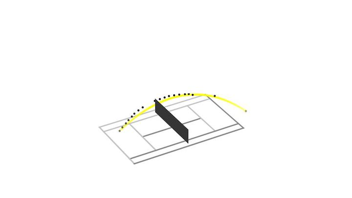

# Introduction
In this blog post I describe how I converted 2d pixel data points into 3d space. I highlight how I converted the 3d data points into 3d space. Once this is done, it's simple to visualise the data. 

# Calculating 3d Coordinates
In the previous steps, we are left off with 2d pixel location. The question is how to convert this 2d pixel data into 3d space. The way I approached this was to set some anchor points in the image and then apply some transformations to the pixel points. 

When visualising the results for just one arc, then it looks like this: 

# Calculating Continuous Trajectory
Using the ball 3d locations that we can see in the previous plot, we can fit a function through the dots optimising the distance to each of the dots. After the function is fit, we can generate an unlimited amount of points on this function and in as small sequences as we want. 

This is what is visualised here:

The steps of the line that is visualised here are very small and the line therefore looks like a perfect arc.  

# Animating 3d trajectories
Using a similar approach as above to generate the 3d data, one can also animate the trajectories. Here, I created a 3d matplotlib visualisation to visualise the tennis ball trajectory:

# Summary
In this blog post, I explained that one can calculate 3d point positions from pixel positions using image anchor points. Further, one can fit a function through the points. At last, one can create visualisations to show the trajectories and can even create a 3d animation. 