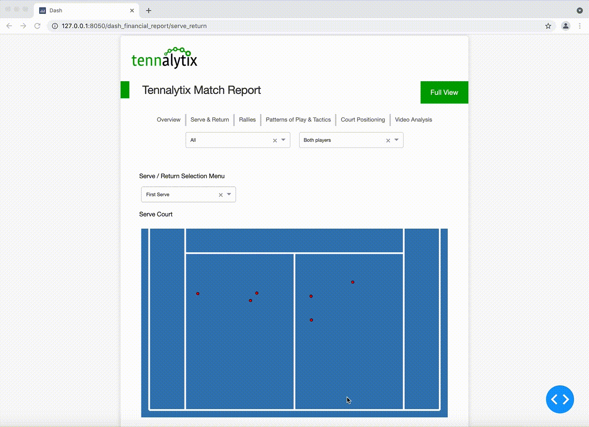
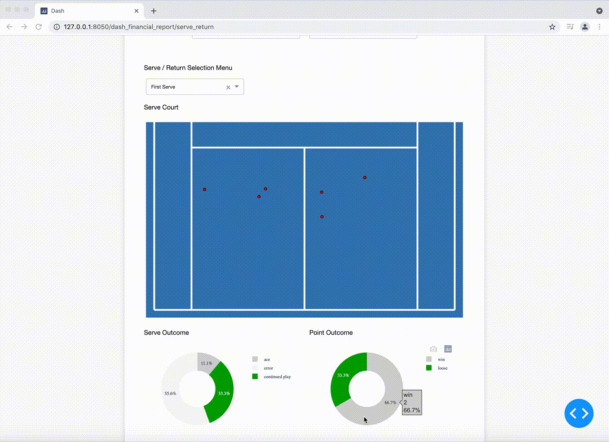

# Introduction
We have been able to generate ball and player tracking using deep learning and some transformations to 3d space. But how can we generate actionable insights for professional tennis players?

The answer is through an interactive dashboard. This allows players to dive into the elements of the analysis that they are most interested in. Additionally, we can link to original video feeds so that players can replay the videos of points. This enhances the trust in the data and allows players to extract the pieces of information they are most interested in. 

In this blog article, I will describe how I created an interactive Dashboard using Dash (based on plotly) and what functionalities I created within the dashboard. 

# Functionalities
The goal of this dashboard was to enable players to interactively engage with the data and let them generate new insights to make the more effective in their game play. In this section, I will describe how the dashboard was structured and two key functionalities that I implemented. 

In the dashboard, I created different pages for different parts of the game play ranging from serve & return, rallies to patterns of play and a video analysis. All visualisations and pages were developed based on the tracking data that was created in the previous steps. 

In this blog post I will highlight two functionalities that I created for the serve & return section. 

## Serve Videos
In the image below, a visualisation of a tennis court is displayed with red dots representing one tennis serve. In the example below, we can see 3 serves to the Deuce and 3 serves to the Ad court side. Players have the ability to click on a red dot in order to see the tennis video of the point which relates to that serve. 

In the example below, we click on a serve to the inner side of the Ad court. The video of that serve opens and we can see in the video that the player serves to the inner side of the court. 

## Serve Outcome Comparison
Another functionality is to compare the outcome of different serves. In the visualisation, we can see two pie charts for *Serve Outcome* and *Point Outcome*. 

The *Serve Outcome* pie chart shows the direct result of all serves selected in the above visualisation, e.g. whether the serve was an ace, an error or whether the serve was returned play was continued. 

The *Point Outcome* pie chart shows how many points were won/lost for the serves selected. 

To change the selection of serves for which we want to get the *Serve Outcome* and *Point Outcome* results, one can use the lasso tool in the tennis court visualisation to mark an area.  

# Summary
In this blog post I described some of the functionalities that I implemented in a dashboard built on Dash. 